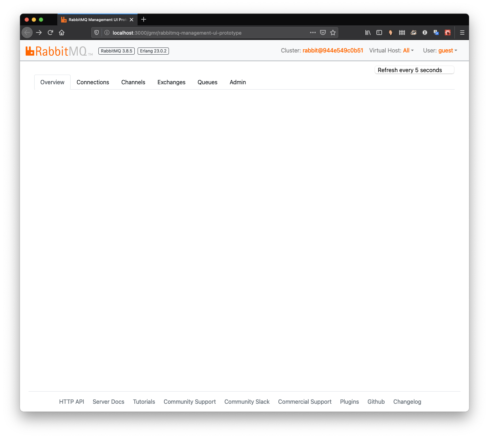

# RabbitMQ Management UI Prototype

A ReactJS RabbitMQ Management UI Prototype 

## Warning

This is a very early prototype and doesn't do much yet. I'm currently working
through the more framework oriented aspects of writing an application like this.

## Project Goals

The primary goal for the project is to provide a modern replacement for the existing
RabbitMQ UI. The hope is that if it's solid enough, and that the right design choices 
are made, that the RabbitMQ team will consider it for inclusion or replacement as the
built-in Management UI.

## What does it look like?

## How can you contribute?

Keep an eye out for documentation on how to contribute.

## What's it built with?

Check out the [Design Decisions](design-decisions.md) document for that kind of info.

## Available Scripts

In the project directory, you can run:

### `yarn start`

Runs the app in the development mode. 
Open [http://localhost:3000](http://localhost:3000) to view it in the browser.

The page will reload if you make edits. 
You will also see any lint errors in the console.

### `yarn test`

Launches the test runner in the interactive watch mode. 
See the section about [running tests](https://facebook.github.io/create-react-app/docs/running-tests) for more information.

### `yarn build`

Builds the app for production to the `build` folder. 
It correctly bundles React in production mode and optimizes the build for the best performance.

The build is minified and the filenames include the hashes. 
Your app is ready to be deployed!

See the section about [deployment](https://facebook.github.io/create-react-app/docs/deployment) for more information.
